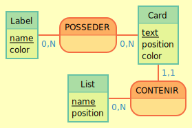

# MCD

## Identifier les entités

- List: name, position
- Card: text, position, color
- Label: name, color

## Identifier les associations et leur cardinalité

- Card <-> List
  - une List contient des Card
  - une Card est contenue par exactement une Liste
- Card <-> Label
  - une Card posséde 0 ou plusieurs Label
  - un Label est possédé par 0 ou plusieurs Card

## MCD schéma

## MLD

- List (id, name, position)
- Card (id, text, position, color, #list_id)
- Label (id, name, color)
- POSSEDER (card_id, label_id)

## Exemple/test

List "Todo", id 37

carte "faires les courses", id 112, list_id 37
carte "terminer Binding of Isaac Repentance", id 301, list_id 37

Label "urgent", id 777
label "perso", id 564

card_has_label:
122, 777
122, 564
301, 564

## Liste des tables

- LIST
  - id: INTEGER GENERATED ALWAYS AS IDENTITY PRIMARY KEY
  - name: TEXT NOT NULL
  - position: INTEGER NOT NULL DEFAULT 0
  - createdAt: TIMESTAMP NOT NULL DEFAULT NOW()
  - updatedAt: TIMESTAMP

- CARD
  - id: INTEGER GENERATED ALWAYS AS IDENTITY PRIMARY KEY
  - text: TEXT NOT NULL
  - position: INTEGER NOT NULL DEFAULT 0
  - color: TEXT
  - list_id: INTEGER NOT NULL REFERENCES "list"("id")
  - createdAt: TIMESTAMP NOT NULL DEFAULT NOW()
  - updatedAt: TIMESTAMP

- LABEL
  - id: INTEGER GENERATED ALWAYS AS IDENTITY PRIMARY KEY
  - name: TEXT NOT NULL
  - color: TEXT NOT NULL DEFAULT '#CCC'
  - createdAt: TIMESTAMP NOT NULL DEFAULT NOW()
  - updatedAt: TIMESTAMP

- CARD_HAS_LABEL
  - card_id: INTEGER NOT NULL REFERENCES "card"("id")
  - label_id: INTEGER NOT NULL REFERENCES "label"("id")
  - createdAt: TIMESTAMP NOT NULL DEFAULT NOW()
  - updatedAt: TIMESTAMP
  - PRIMARY KEY ("card_id", "label_id")

## Petit rappel sur SERIAL

SERIAL marche très bien tant qu'on ne met rien dans la colonne.

Les problèmes commencent si on insère un nombre dans la colonne, qui est au dessus de la valeur max actuelle du serial.
Lorsque le SERIAL va tenter de s'incrémenter jusqu'à cette valeur déjà existante, la requête va planter.

Pour éviter ça, on décortique !
SERIAL => INT GENERATED AS IDENTITY

- INT => integer
- GENERATED => "si je donne rien, débrouille toi"
- AS IDENTITY => "les valeurs seront toutes uniques"

"GENERATED AS IDENTITY", c'est pas mal, mais ça ne résoud pas le problème que si un petit malin donne un id, la BDD va l'accepter...

Au final on utilise "GENERATED ALWAYS AS IDENTITY" => le always signifie "je n'ai pas le droit de te donner une valeur, tu DOIS la gérer".

Dernier point, un "AS IDENTITY" doit toujours ête PRIMARY KEY (ou en tout cas avoir une contrainte UNIQUE)
